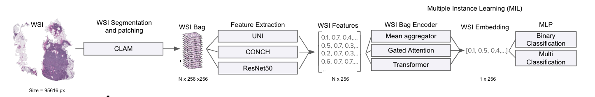

# MIL for WSI classification with Post-Hoc Explainability Maps

This is the repo for the final project of the group under the supervision of David Anglada for the UPC School's Artificial Intelligence with Deep Learning postgraduate course, online edition of winter 2024-2025. The team members are:

- [David Anglada (Advisor)](david.anglada@upc.edu)
- [Eric Matamoros](ericmatamoros1999@gmail.com)
- [Núria Blasco](nuriablasco35@gmail.com)
- [Marcel Maragall](marcelmaragall@gmail.com)
- [Mireia Torres](miretorres.macia@gmail.com)

The goal of this project is to develop a comprehensive, end-to-end solution for the automated evaluation of Whole Slide Images (WSIs) in cancer diagnosis using Multiple Instance Learning (MIL).  The solution aims to:

- Integrate an evaluation framework to easy perform experiments and compare methodologies. Currently supported methodologies include mean aggregation, attention mechanism and transformer-based encoding, which are further detailed in the incoming sections.
- Centralize parametrization through a config.yaml for easy iteration with controled parameters. Furthermore, all required steps for processing, training and evaluating images is centralized through a  pipeline.
- Enable seamless deployment through a Streamlit-powered interactive platform, allowing pathologists and researchers to upload WSIs and obtain a class prediction as well as a visual representation of the regions-of-interest that lead the model to predict the given class.

# Running the code

## Set up virtual environment & install dependencies

1. Download the project file or clone the repository.

2. Install Anaconda or Miniconda, a virtual environment manager that allows us to ensure proper dependency management and version control.

```bash
# Retrieve miniconda
wget https://repo.anaconda.com/miniconda/Miniconda3-latest-Linux-x86_64.sh

# Check the integrity of the installer
sha256sum Miniconda3-latest-Linux-x86_64.sh

# Execute installer
bash Miniconda3-latest-Linux-x86_64.sh
```

3. (A) You can quickly create the environment through the available `env.yml` file, which will be named **wsi**:

```bash
conda env create -f env.yml
```

Activate the environment:
```bash
conda activate wsi
```

Deactivate the environment:
```bash
conda deactivate wsi
```

3. (B) Alternatively, use any other virtualization machine (like venv) and install the packages through the `Makefile`:
```bash
make venv
```

## Pre-requisites

The project requires the creation of a folder that contains the all the images in .SVS extension and a `target.csv` with the label classification for each image plus any additional metadata needed. Example of the structure below:

```bash
BRACS_260.svs
BRACS_261.svs
BRACS_262.svs
BRACS_263.svs
BRACS_264.svs
BRACS_265.svs
target.csv
```

The `target.csv` file must contain the following columns:
- **`target`**  Encoded numerical categories for each of the images.  
- **`slide`**  Name of images, including the `.svs` extension.
- Additionally, it can contain additional columns with metadata (patient, region of interest, etc.)

You can refer to `./notebooks/process_bracs.ipynb` for an example of processing an excel into the desired format.

## Configuration file

The configuration file is found in `./config/config.yaml` and is the central place to control the parameters and folders. It has the following structure:

```bash

data_path: "./mil_wsi/data/"  # Folder where .SVS and target.csv images are stored
results_path: "./mil_wsi/results/" # Folder to store processed files including patches, segments or masks
metrics_path: "./mil_wsi/metrics/" # Folder to store training and evaluation metrics
models_path: "./mil_wsi/models/" # Folder to store trained models


experiment_name: 'example_name' # Name of the experiment - for sub-folder experiment-specific subfolder creation - 

Additionally, contains parameter that can be tuned for each of the steps in the pipeline (eg. epochs, batch size, step, etc.)
```

## Execution
After desired parameters have been configured and data has been retrieved, the pipeline can be easily triggered through a `tasks.py` script

```bash
python -m tasks.py
```

It will automatically display in the terminal the different available tasks, where the user can specify if a specific step wants to be executed (Tasks 1-6) or the full pipeline instead (Task 7):

    Select a task to run:
    [1] Create Patches
    [2] Extract Features
    [3] MLP Model
    [4] Weighted Model
    [5] Attention MIL
    [6] Transformer MIL
    [7] Run Full Pipeline
    Enter the number of the task:

From a technical point-of-view, each task triggers a subprocess system task with ingesting the parameters and paths specified in the configuration file. Example below:

```bash
"conda run -n wsi CUDA_VISIBLE_DEVICES=0 python -m mil_wsi.scripts.mlp_model  --dir_results {results_path} --dir_data {data_path} --dir_model {models_path} --dir_metrics {metrics_path} --batch_size {model_conf_settings['batch_size']} --hidden_size {model_conf_settings['hidden_size']} --epochs {model_conf_settings['epochs']} --test_size {model_conf_settings['test_size']} --k_folds {model_conf_settings['k_folds']} --learning_rate {model_conf_settings['learning_rate']} --experiment_name {settings['experiment_name']}"
```

Furthermore, we created a **streamlit application** that can be executed through:
```bash
streamlit run app.py
```

## Overal Project Structure

The project has been structured following the DevOps practices for monolithic applications development. Below you can find a tree-level structure of the project:

```bash
mil_wsi/
│── CLAM/                       # CLAM internal integration & modifications from https://github.com/mahmoodlab/CLAM/tree/master repository 
│── config/                     # Folder for the configuration file
│── data/                       # Data folder to allocate WSI images and target.csv file (a user can also create its own folder)
│── interfaces/                 # Central place for functions and classes leveraged by the project
│   │──attention_mil.py         # Code implementation for Attention MIL
│   │──focal_loss.py            # Code implementation of the Focal Loss used to penalize imbalanced classes
│   │──metrics.py               # Code implementation for binary & multiclassification problems. Computes Precision, Accuracy and F1
│   │──mil_dataset.py           # Custom data loader for MIL Dataset. Generates bags, labels & filename
│   │──mlp_model.py             # Code implementation for MLP model benchmark
│   │──plot_loss.py             # Generates and plots losses
│   │──transformer_mil.py       # Code implementation for Transformer MIL
│── metrics/                    # Default folder to store metrics for each of the experiments
│   │── experiment_name
│   │    │── losses_graphs      # Contains training and evaluation losses
│   │    │── metrics.json       # Average classification metrics across the different folds
│   │    │── predictions.csv    # 1 CSV per K-Fold generated with the predictions and the ground-truth labels
│── models/                     # Default folder to store metrics for an experiment (in .pth format)
│── notebooks/
│   │── process_bracs.ipynb     # Notebook example to generate the required target.csv file
│── results/                    # Default folder to store masks, patches and pt file (outputs from patching and feature extraction)
│── scripts/                    
│   │──attention_mil_model.py   # Script interface to load data, train Attention model and perform predictions for each K-Fold
│   │──convert_to_png.py        # Convert .SVS images to PNG format
│   │──create_patches.py        # Script to create patches from SVS
│   │──extract_features.py      # Script to extract features from masked images
│   │──feature_projection.py    # Script to project features into each of the classes (through a UMAP)
│   │──mlp_model.py             # Script interface to load data, train MLP model and perform predictions for each K-Fold
│   │──transformer_mil_model.py # Script interface to load data, train Transformer MIL model and perform predictions for each K-Fold
│── __init__.py
│── tasks.py                    # Script with each task definition to automatize pipeline execution
│── .gitignore                  # Ignore files in GitHub
│── aidl_wsi.code-workspace     # Workspace
│── app.py                      # Streamlit application
│── env.yml                     # Conda envinoment creation YAML
│── LICENSE                     # License of propertarity of the code
│── README.md                   # Readme file
│── requirements.txt            # File with required dependencies. It is read by Makefile when executing 'make venv'
│── setup.py                    # Setup project into a package-like format
```


# Project motivation
The primary challenge in cancer detection, particularly for melanoma and other skin cancers, lies in the variability and complexity of histopathological images. Traditional diagnostic methods rely heavily on biopsy analysis, which involves manual examination by pathologists. However, this approach has some limitations including:

- Lack of standardized procedures for processing and analyzing images across the industry
- Annotating WSIs requires expert pathologists, making large-scale manual labeling time-consuming and expensive
- Early-stage cancer can be difficult to detect due to small, subtle cellular changes that may be overlooked in traditional pathology workflows.

In order to overcome the before mentioned issues, deep learning models have proven to be highly effective in addressing the challenges associated with WSI processing and cancer detection, enabling efficiently extract valuable features from the images that are related with cancerous conditions. In that line, Multiple Instance Learning (MIL) is a weakly supervised learning framework that learns from WSI labels in order to extract which relevant patches are more relevant for the given label categorization.

# Architecture Overview



# Milestones
Based on the technical architecture, different milestones were identified:

- [**Milestone 1. Data Collection**](#milestone-1-data-collection)
- [**Milestone 2. Data Preprocessing I: Segmentation of WSI and Patch Generation**](#milestone-2-data-preprocessing-i-segmentation-of-wsi-and-patch-generation)
- [**Milestone 3. Data Processing II: Feature Extraction**](#milestone-3-data-processing-ii-feature-extraction)
- [**Milestone 4. Bag Encoders for MIL**](#milestone-4-bag-encoders-for-mil)
- [**Milestone 5. Explainability Maps Implementation**](#milestone-5-explainability-maps-implementation)
- [**Milestone 6. Streamlit Application Development**](#milestone-6-streamlit-application-development)


## **Milestone 1. Data Collection**

A total of **five datasets** have been identified that contain **Whole Slide Images (WSIs)** covering a variety of cancer types. These datasets provide a diverse range of histopathological samples, mainly on breast cancer:

| **Dataset Name** | **Description** | **Link** |
|-----------------|---------------|---------|
| BCNB  | Doesn't contain non-cancerous images | [Link](https://bcnb.grand-challenge.org/Dataset/) |
| BRACS  | Multiclass dataset with non-cancerous, bening & malignant conditions | [Link](https://www.bracs.icar.cnr.it/details/) |
| CAMELYON16  | Binary class dataset with normal & lymph node metastasis condition | [Link](https://camelyon16.grand-challenge.org/Data/) |
| SLN-Breast  | Binary class dataset with normal & carcinoma breast cancer | [Link](https://www.cancerimagingarchive.net/collection/sln-breast/) |
| HEROHE  | Binary class HER+ and HER- WSI samples | [Link](https://ecdp2020.grand-challenge.org/Dataset/) |

For more detailed information on these datasets, refer to the [AIDL Data Sources](images/aidl_datasources.pdf)

For our study we will be leveraging **2 datasets**:

- SLN-Breast as an initial dataset to develop our framework with binary classification and contains a total of 130 de-identified whole slide images of H&E stained axillary lymph node specimens from 78 patients. Metastatic breast carcinoma is present in 36 of the WSI from 27 patients.

- BRACS as a dataset to implement a more complex multiclassification framework. However, due to the total size of the dataset (around 1TB) we have retrieved some sample images from the Group BT and Group MT containing:
    * Group_BT contains sets of normal tissue images and of two histopathological distinct subtypes of benign breast lesions: Type_N, Type_PB,  Type_UDH that include WSIs annotates as Normal (N), Pathological Benign (PB), Usual Ductal Hyperplasia (UDH)
    * Group_MT is divided in two subsets Type_DCIS and Type_IC including WSIs annotated as Ductal Carcinoma in Situ (DCIS) and Invasive Carcinoma (IC) lesion subtypes.


## **Milestone 2. Data Preprocessing I: Segmentation of WSI and patch generation**

For the proper segmentation & patch generation of the WSI we have leveraged the Clustering-constrained Attention Multiple Instance Learning ([CLAM](https://github.com/mahmoodlab/CLAM/tree/master)) framework. It is is a deep-learning-based weakly-supervised method that uses attention-based learning to automatically identify sub-regions of high diagnostic value in order to accurately classify the whole slide, while also utilizing instance-level clustering over the representative regions identified to constrain and refine the feature space.

CLAM package core functionalities have been integrated into our framework in order to gain more control of the code and functions while also being able to integrate it into our end-to-end solution, which we couldn't achieve with installing the package from Github due to cycling imports and issues while using it.

CLAM uses OpenSlide to tile the image into smaller patches (e.g., 256×256 or 512×512 pixels). Since not all patches contain relevant tissue, CLAM applies tissue detection to remove background (empty/white) regions through adaptative thresholds.


## **Milestone 3.Data Processing II: Feature Extraction**

We have leveraged CLAM package as well for proper feature extraction. CLAM uses a pretrained Convolutional Neural Network (CNN) to extract meaningful feature vectors from patches of WSIs. The extracted features are then used in the MIL model for classification. It supports this 3 encoder-based models for feature extraction:

- **ResNet50**: It is a CNN architectured consisting of 50 layers, divided into multiple stages, where each stage has convolutional layers and residual connections
- **UNI**: It is a self-supervised learning (SSL) model. It uses contrastive learning techniques to align similar patches and separate dissimilar ones. It uses Vision Transformers (ViTs) rather than traditional CNNs used in ResNet50.
- **CONCH**: It is an advanced self-supervised clustering model. It uses contrastive learning with clustering that learns tissue representations without labels and incorporates attention modules to focus on the most relevant image regions.


All 3 encoder-based models are contemplated as dependent conditions in our experiments.

## **Milestone 4. Bag Encoders for MIL**
After patches have been identified and features extracted we end with a vector representation of (N, NDimensions) bag for each WSI image, where N is each of the patches identified in the image and NDimensions are each of the latent space dimensions identified by the encoder-model. 

Different supervised classification models are used to relate the bags with its representative label: 
    - **1) Mean aggregation with MLP**
    - **2) Gated Attention Mechanism**
    - **3) Transformer-based Encoding**

Some common parameters are shared across the models
- **`test_size`** (`--test_size`):   Specifies the proportion of the dataset to be used for testing.
- **`k_folds`** (`--k_folds`):  Specifies the number of folds for **K-Fold Cross-Validation**. This technique improves model evaluation by training on different subsets of the data.
- **`learning_rate`** (`--learning_rate`): Controls the rate at which model parameters are updated during training.
- **`batch_size`** (`--batch_size`):  Specifies the number of samples processed together in each training step.
- **`epochs`** (`--epochs`):  Defines the number of times the entire training dataset is passed through the model.


### **1. Mean aggregation with MLP**: 
The final Whole Slide Image (WSI) representation is obtained by calculating the arithmetic mean of the representations across all patches with a final Multi-Layer Perceptron (MLP) to predict the label category. This methodology will be used as a benchmark model for its simplicity to average the patches into a single representation.


The following parameters can be tuned:
- **`hidden_size`** (`--hidden_size`):  Determines the size of the hidden layer(s) in the Multi-Layer Perceptron (MLP) network.

### **2. Gated Attention Mechanism**: 
This mechanism is used to dynamically weight the importance of each patch embedding based on its relevance to the outcome label. 


The following parameters can be tuned:

- **`hidden_size`** (`--hidden_size`):  Determines the size of the hidden layer(s) in the MIL network.
- **`n_heads`** (`--n_heads`):  Defines the number of attention heads in the multi-head attention mechanism. More heads allow the model to capture different aspects of the input features.
- **`attention_class`** (`--attention_class`, default: `"AttentionMIL"`):  Determines the type of attention mechanism used in MIL. The options are:
  - `"AttentionMIL"`: Uses a single attention mechanism to weigh patch embeddings.
  - `"MultiHeadAttentionMIL"`: Employs multiple attention heads to capture diverse feature representations.

### **2. Transformer-based Encoding**: 
This approach leverages an additional **Transformer encoder** to process the collection of patch embeddings. Similar to the initial patch encoding phase, this encoder generates a new `[CLS]` token that encapsulates the collective information of the entire bag of patch embeddings. This enables a deeper contextual analysis of patch-level features in relation to each other.


This approach shares the same parameters as the the **Gated Attention Mechanism** shared before.

## **Milestone 5. Explainability Maps Implementation**
As a final step we will create a visual representation that highlights the most influential regions (patches) in a Whole Slide Image (WSI), offering insights into the key aspects leading to the final decision-making process of the model. Heatmaps are color-coded based on the  **attention weights** 
of the **Gated mechanism** and the **Transformer-based encoding** approaches previously explained.

Attention weights are assigned to each patch, forming a discrete distribution. To enhance continuity and interpretability, we applied a Gaussian smoothing filter to create a more refined and visually coherent representation with an alpha of 4.


Find below an example of the heatmap:


## **Milestone 6. Streamlit application development**
The primary users of this project are histopathology experts who can utilize this framework to efficiently obtain visual interpretations of cancerous regions. Since this audience generally lacks technical expertise in running Python code, we developed a user-friendly Streamlit application to ensure an intuitive and accessible experience.

Streamlit is an open-source Python library that makes it easy to create interactive web applications that can be deployed either in the local machine (through a specific port) or opened to internet throughStreamlit Cloud, AWS or any other host provider. We have only explored the local deployment solution but aim to work on a cloud-based host in the future.

# Experiment results

RESULTS

# Streamlit application in action
Below you can find a video showcasing the **Streamlit application** performing real-time inference of a given WSI, where it's generating the whole image segmentation, masking, feature extraction, prediction of the class and heatmap generation in real time:

**Click on the image** to load the Youtube video:
[](https://www.youtube.com/watch?v=4ZEaZEFkQZM)


# Work In Progress (WIP) - UPDATE ON 16/03/2026
- Implement Hyperparameter Tuning in the pipeline using Bayesian Search for efficient parameter selection.
- Perform training and evaluation on the entire BRACS dataset using GPU Cloud Computing due to existing resource limitations in local machines.
- Enhance User Interface (UI) of the Streamlit application and host it through a cloud provider.
- Implement a LLM-as-judge to evaluate relation of highlighted patches with the regions of interest for a given classification. Validate with histopatologists.

# Conclusions and final thoughts

## 1. Technical Perspective
1. Handling Whole Slide Images (WSI) is challenging due to their large file sizes, with an average of 2.5GB per file in the BRACS dataset. Managing extensive datasets locally requires substantial computational resources.
2. We successfully developed a framework for training Multiple Instance Learning (MIL) models, enabling accurate classification of WSIs into their respective categories.
3. Explainability Maps demonstrate the effectiveness of attention-based mechanisms in identifying critical regions of interest, enhancing model interpretability and supporting more reliable classification decisions.

## 2. Project Perspective
1. These architectures are designed to assist histopathologists rather than replace them. By highlighting key regions of interest, the framework can streamline the diagnostic process and improve efficiency without compromising human expertise.
2. The model’s performance should be evaluated on diverse datasets to ensure robustness across different WSI sources, staining techniques, and pathology conditions. Most of the datasets are from breast cancer conditions, which limit the extrapolation of this frameworks to other domains.
3. Further improvements could involve integrating multi-modal data, such as genomics, radiology, and patient metadata, to enhance predictive power and provide a more comprehensive diagnostic tool.


# References and notes
1. C. Hernández-Pérez, L. Jimenez-Martin and V. Vilaplana, "Bridging Domains in Melanoma Diagnostics: Predicting BRAF Mutations and Sentinel Lymph Node Positivity with Attention-Based Models in Histological Images," 2024 IEEE/CVF Conference on Computer Vision and Pattern Recognition Workshops (CVPRW), Seattle, WA, USA, 2024, pp. 5132-5140.
2. J. Yao, X. Zhu, M. Li, and J. Huang, "Whole Slide Images Based Cancer Survival Prediction Using Attention Guided Deep Multiple Instance Learning Networks," Medical Image Analysis, vol. 65, p. 101789, Oct. 2020.
3. R. J. Chen, Z. Lu, C. Wang, J. Y. Wu, T. Krishnan, A. L. Bearce, T. N. H. Nguyen, M. J. Shaban, J. Kalpathy-Cramer, and F. Mahmood, "Scaling Vision Transformers to Gigapixel Images via Hierarchical Self-Supervised Learning," ArXiv:2206.02647 [Cs]
4. A. Shahrjooihaghighi and H. Frigui, "Local Feature Selection for Multiple Instance Learning," Journal of Intelligent Information Systems, Nov. 2021.
5. M. Kang, H. Song, S. Park, D. Yoo, and S. Pereira, "Benchmarking Self-Supervised Learning on Diverse Pathology Datasets," Proceedings of the IEEE/CVF Conference on Computer Vision and Pattern Recognition, pp. 3344-3354, 2023.
6. H. Ramsauer, B. Schäfl, J. Lehner, M. Seidl, K. R. Müllner, T. Unterthiner, A. Brandstetter, and S. Hochreiter, "Hopfield Networks Is All You Need," ArXiv:2008.02217 [Cs, Stat], Apr. 2021. 
7. X. Wang, S. Yang, J. Zhang, M. Wang, J. Zhang, W. Yang, et al., "Transformer-Based Unsupervised Contrastive Learning for Histopathological Image Classification," Medical Image Analysis, vol. 81, p. 102559, 2022, doi: 10.1016/j.media.2022.102559.
8. F. Wessels, M. Schmitt, E. Krieghoff-Henning, M. Nientiedt, F. Waldbillig, M. Neuberger, M. C. Kriegmair, K.-F. Kowalewski, T. S. Worst, M. Steeg, et al., "A Self-Supervised Vision Transformer to Predict Survival from Histopathology in Renal Cell Carcinoma," World Journal of Urology, vol. 41, no. 8, pp. 2233-2241, 2023, doi: 10.1007/s00345-023-04463-6.